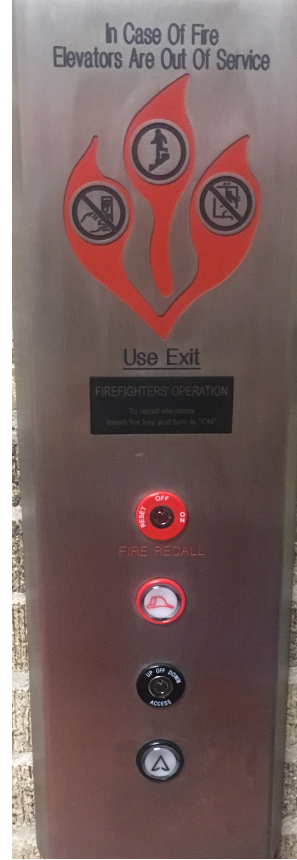

# ElevatorInterface

The elevator I choose is located on campus. It is the Mechanical Engineering South elevator. 

The current design doesn't have the floor numbers in ascending order as well as the buttons being too close to the emergency buttons. Therefore, it can be very easy to press the wrong button. 

Whenever I use an elevator, I use it to select a floor, close the door, open the door, or contact help if something goes wrong. The elevator does have these features, but users have to be careful that they don't press the wrong button. Whenever a user uses an elevator, they usually press the button corresponding to the floor they wish to travel. If they are in a rush or they didn't want to use the elevator, the user can press either the open and close buttons. The elevator support uses pictures and labels for users to figure out which button to press. Whenever an user press a button, that button turns red indicating that they have selected a button. As previously stated, the floor buttons are not lined up vertically in ascending order, so the user could accidently press the first floor when they wanted to go to the second floor. In addition, the user could press the alarm button by accident due to the close proximity of all the buttons. I recommend changing the interface to where there is a clear divide between the floor buttons and the emergency buttons. That way, the users won't be confused to pressed to wrong button. 

Here is the touchscreen interface. 

https://Jomba98.github.io/ElevatorInterface/touchscreenInterface.html
